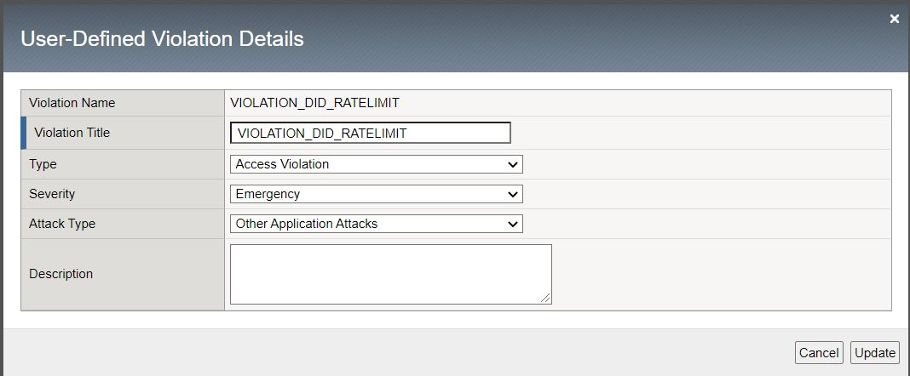
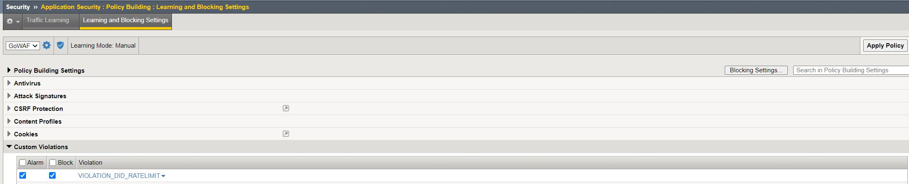

# DeviceID Plus WAF iRules
Code for various Shape DeviceID+ Use-cases

## RATE_LIMIT
- Simple functionality similar to F5 ASM/Advanced WAF Session tracking but instead of using the Client IP or the local DeviceID we are using Shape Device ID+ for event correlation
- Currently only uses the Device-based identifier and not the residue-identifier for tracking
- Maintains a subtable for each DeviceID
- Triggers >= 5 violations (they must be flagged as violations by ASM/Advanced WAF)
- Silent drop is used after 5 violations... No support ID will be provided to the client/attacker at this point
- Default block timer of 30 seconds for any offending DeviceID
- ***There is currently no integrity checking of the cookies used for DeviceID+ identifiers at this time. Thus, this is simply a proof of concept and should not be relied upon for security enforcement as it is currently susceptible to replay, hijacking and other such attacks.***

###Using the RATE_LIMIT iRule
1. On the BIG-IP, create a Custom Violation type within the WAF configuration menu. Security > Options > Application Security > Advanced Configuration > Violations List
2. Click on the "User-Defined Violations" tab then click create.
3. Fill out the violation details as per the screenshot:

4. In the learning and blocking settings, set the Custom violation to Alarm and Block as per the screenshot:

5. Create the iRule and associate the iRule with the VS of your choice, ensuring a Security Policy is also already defined and associated.
6. Don't forget to ENJOY!

## WAF_BLOCK_LOGGING
- Simple iRule to better correlate ASM/Advanced WAF violations with the Shape DeviceID+ value
- By using this iRule, a Security Operations team can better correlate attacker activity across their various web properties by leveraging the Shape Device ID value of the attacker
- Currenty logs to local ONLY, but one can easily modify this code to instead send these logs to a high speed logging destination such as the SIEM of your choice

*Code is provided as-is. No warranty is implied.*
